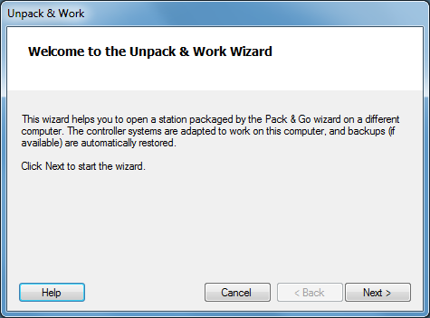
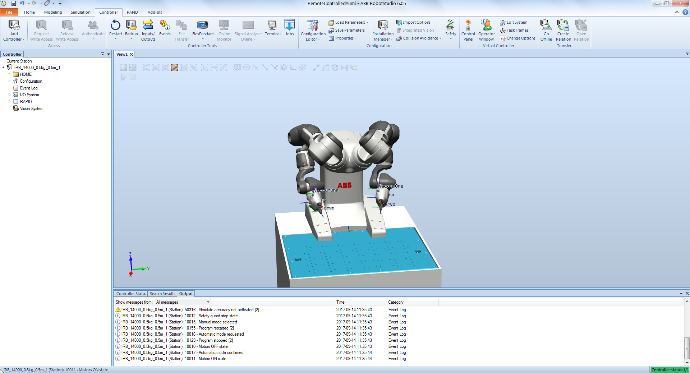
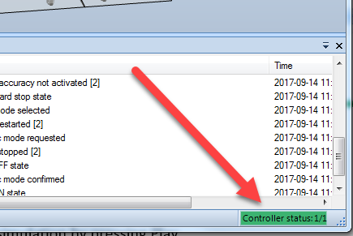
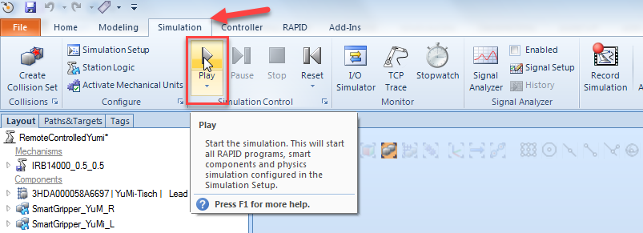
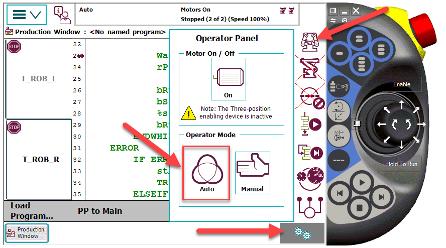
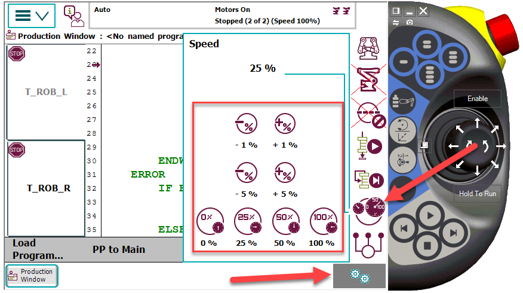

# RobotStudio
RobotStudio is a simulation and programming tool for robots. For each virtual robot there is a **Virtual Controller (VC)** running the same software as the real robot. The VC controls robots motion and makes sure that is the same as for a real robot.

   * [Get RobotStudio](http://new.abb.com/products/robotics/robotstudio/downloads)
   
To run RobotStudio in a virtual machine you will need a license key. Come to our booth and we will provide you with one.

Learn more about RobotStudio by looking at the [tutorial videos](http://new.abb.com/products/robotics/robotstudio/tutorials). Here you can find out how to create your own movements and gestures. Also, come by our booth and we will help you!

##RobotStudio Pack&Go
Double click on the RobotStudio Pack&Go file HackZurich.rspag.

Follow the instructions in the installation wizard.

After the installation, the virtual robot should appear.

##Starting the virtual robot
Open RobotStudio and start the station HackZurich.rsstn if it’s not already started.

Wait until the virtual controller is completely started. The controller state status at the bottom should be green.

Change to the Simulation Slide and start the simulation by pressing Play.

##Starting the real robot
Take the FlexPendant and set the Program Pointer to main in the Production window.

Change the robot state to automatic mode. Open the quick launch menu by pressing the  Button and open the Operator panel by pressing .

Start the Motor.

Set the robot speed. Open the quick lunch menu by pressing the   Button and open the Speed panel by pressing 

Now press the play button at the FlexPendant.

# Robot Web Services
Robot Web Services is an HTTP based API for controlling robots. You will use it to control both virtual and real robots.

   * [API Reference](http://developercenter.robotstudio.com/blobproxy/devcenter/Robot_Web_Services/html/index.html)

# Connecting to the Virtual Controller
The VC will listen on port 80 for inbound HTTP traffic as soon as it is started. It is possible to interact with it via this REST API. Few things to note:
* The VC requires [Digest Authentication](https://en.wikipedia.org/wiki/Digest_access_authentication) from the users with a default username/password of 'Default User'/'robotics' (without ' marks). Following classes have been tested to work with this communication:
    * [Requests](http://docs.python-requests.org/en/master/#) in Python. [Simple Example](Examples/PythonRobot)
    * [Request](https://www.npmjs.com/package/request) in Node.js [Example](../Misc/Javascript_Electron)
    * [Windows.Web.Http.HttpClient](https://docs.microsoft.com/en-us/uwp/api/windows.web.http.httpclient) for C# Windows Store Application [Example](../Misc/UWP_C#)
    * [System.Net.Http.HttpClient](https://msdn.microsoft.com/en-us/library/system.net.http.httpclient(v=vs.118).aspx) For C# and WinForms, WPF,... . [Example](Examples/RemoteRobot)

# Examples
  ## [RemoteRobot](https://github.com/Mandur/HackZurich2017/tree/master/ABB/Examples/RemoteRobot) (C#)
  A C# example with some (hopefully) reusable code.
  ## [PythonRobot](https://github.com/Mandur/HackZurich2017/tree/master/ABB/Examples/PythonRobot) (Python)
  A python example to get some communication set up with the robot.
  
There are also complete examples for [UWP](https://github.com/Mandur/HackZurich2017/tree/master/Misc/UWP_C%23) and in [JS](https://github.com/Mandur/HackZurich2017/tree/master/Misc/Javascript_Electron) that connect a robot with the Azure cloud services.

# Triggering motion with RobotStudio
The default gesture already configured in the robot are the following: 
* Home 
* Contempt
* Kiss
* No Clue
* Hands Up
* Suprised
* To Diss
* Anger
* Excited
* Give Me A Hug
* Go Away
* Happy
* Powerful
* Scared
